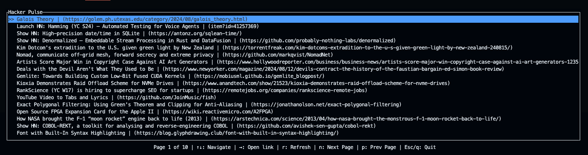

# Hacker Pulse

Hacker Pulse is a terminal-based user interface (TUI) application that allows you to browse the latest submissions from Hacker News. With a simple and intuitive interface, you can navigate through articles, open links in your browser, and refresh the list of submissions.



## Table of Contents

- [Hacker Pulse](#hacker-pulse)
  - [Table of Contents](#table-of-contents)
  - [Features](#features)
  - [Installation](#installation)
  - [Usage](#usage)
  - [Contributing](#contributing)
  - [License](#license)

## Features

- Browse the latest Hacker News submissions.
- Navigate through articles using the arrow keys.
- Open articles in your default web browser.
- Refresh the list of submissions.
- Pagination support to navigate through multiple pages of articles.

## Installation

To install Hacker Pulse, you need to have Rust and Cargo installed on your machine. If you haven't installed Rust yet, you can do so by following the instructions on the [official Rust website](https://www.rust-lang.org/tools/install).

Once you have Rust and Cargo installed, you can clone the repository and build the project:

```bash
git clone https://github.com/yourusername/hacker_pulse.git
cd hacker_pulse
cargo build --release
```

## Usage
To run Hacker Pulse, execute the following command in your terminal:
```bash
cargo run
```

This will start the application, and you will see the latest submissions from Hacker News.
Key Bindings
- ↑ / ↓: Navigate through the list of articles.
- →: Open the selected article in your default web browser.
- r: Refresh the list of submissions.
- n: Go to the next page of submissions.
- p: Go to the previous page of submissions.
- esc / q: Quit the application.

## Contributing
Contributions are welcome! If you have suggestions for improvements or new features, feel free to open an issue or submit a pull request.
Fork the repository.

## License
This project is licensed under the MIT License.